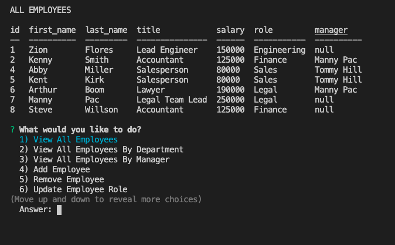

# Employee Tracker
    
## Description 
This is a simple application that creats a mysql database containing employees and links those employees with their corosoponding job title, salary, department, and manager.

## Table of Contents
- [Installation](#installation)
- [Usage](#usage)
- [Contribution](#contribution)
- [License](#license)
- [Contact Me](#contact-me)
- [Screen Shots](#Screen-Shots)
- [Video](#video)

## Installation
1) Clone repository to your local system
2) Open in VS code
3) run a npm install in server.js integrated terminal
4) Copy DB files and paste them in your mySQL to create database and pre-populate it
5) run npm start in server.js integrated terminal

## Usage
1) View employees, roles, departments and managers
3) add employees and managers
4) update employees and managers

## Contribution
Zion Flores

## License
MIT

## Contact Me
GitHub: https://github.com/Zi-on

Email: Zioniflores12@yahoo.com

## Screen Shots

## video 

[Employee Tracker](https://www.youtube.com/watch?v=b30Vmbir7xM&t=3s)

